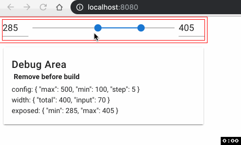

# ipyvuelink-example-1



## 1 - Bootstapping

This project is generated via [@vue/cli](https://cli.vuejs.org/) with the following manually selected features:

- Babel
- Linter/Formatter
- ESLint + Prettier
- Lint on save
- config in dedicated files

Then the following extra configuration was applied:

- add vuetify plugin:
  - `vue add vuetify` with default options

- add dev packages `yarn add -D xxx`:
    - @vue/eslint-config-prettier

* [.eslintrc.js](.eslintrc.js) extra config - see comments
* [.prettierrc.js](.prettierrc.js) extra config - see comments
* [vue.config.js](.prettierrc.js) extra config - see comments

_Tip_: With VSCode create a custom shortcut for doc formatting different from the standard `Alt+Shift+F` (say `Alt+Shift+G`) to avoid conflicts.

## 2 - Project setup

```
yarn install
```

### Compiles and hot-reloads for development

```
yarn serve
```

### Compiles and minifies for production

```
yarn build
```

### Run your tests

```
yarn test
```

### Lints and fixes files

```
yarn lint
```

### Customize configuration

See [Configuration Reference](https://cli.vuejs.org/config/).

## 2 - Use ipyvuelink

Cf. [ipyvuelink repo](https://github.com/mariobuikhuizen/ipyvuelink)

### 1 - Get ipyvuelink

In terminal:

```bash
# first download
git submodule add https://github.com/mariobuikhuizen/ipyvuelink.git

# after a git clone
git submodule update --init
```

### 1 - Develop

You need several terminals:

```bash
# TERMINAL 1
# regular vue dev
yarn serve

# TERMINAL 2
# ipyvuelink cli one time commands
ipyvuelink/cli install-dev
ipyvuelink/cli watch

# TERMINAL 3
# ipyvuelink repeat commands
# re-run each time you changed the vue component
ipyvuelink/cli build-lib

# TERMINAL 4
# launch notebook
jupyter notebook

# TERMINAL 5
# launch jupyterlab
jupyterlab --watch
# DOES NOT WORK
```

